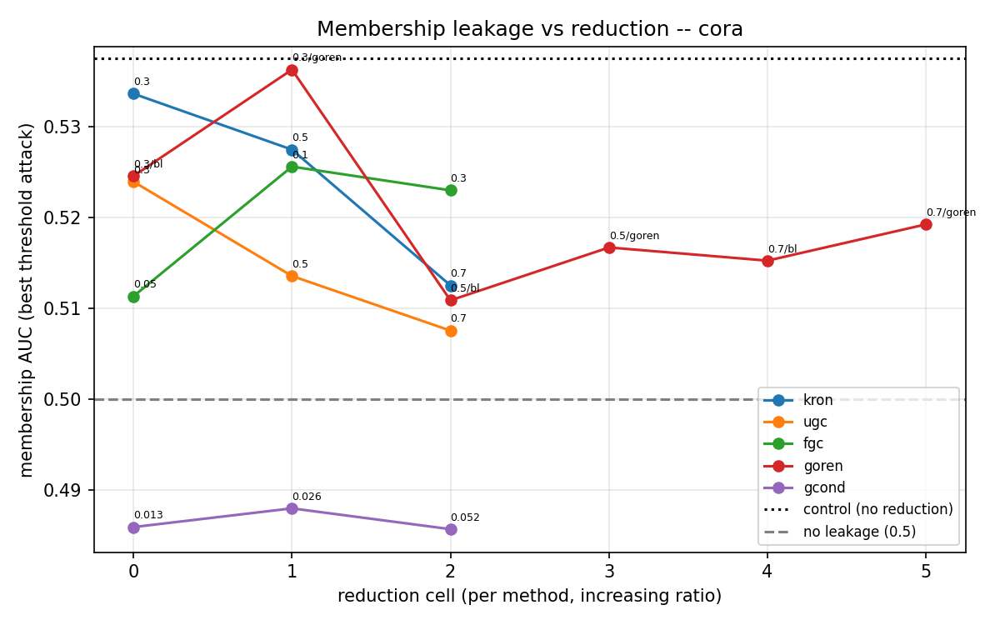
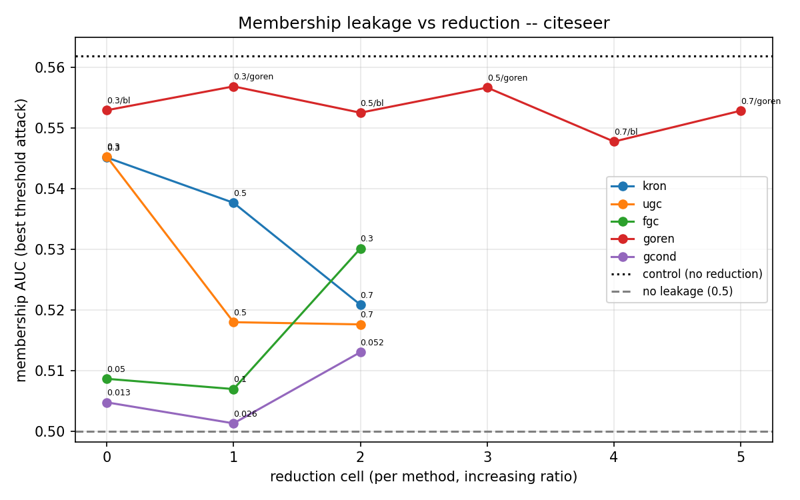

# Node membership-inference benchmark -- results

Does reducing the training graph lower a GNN's node membership leakage? Each dataset is split into members (V_in, 80%) and non-members (V_out, 20%, nodes and edges removed). Every method reduces V_in only; a uniform 3-layer GCN trains on the reduction and is served on the original graph. The 8-attack link-stealing battery does not apply here -- membership is a per-node question -- so the attacks are: unsupervised thresholds (confidence, entropy, loss, correctness) and a shadow MLP trained on the other dataset at the same cell. AUC 0.5 = no leakage.

## cora

| method | ratio | k | acc gap | best threshold AUC | shadow AUC |
|---|---|---|---|---|---|
| control | whole | 2166 | +7.50 | 0.5375 | 0.5430 |
| kron | 0.3 | 1516 | +6.73 | 0.5336 | 0.5200 |
| kron | 0.5 | 1083 | +5.50 | 0.5275 | 0.5315 |
| kron | 0.7 | 650 | +2.00 | 0.5125 | 0.5033 |
| ugc | 0.3 | 1527 | +4.79 | 0.5239 | 0.5078 |
| ugc | 0.5 | 1084 | +2.71 | 0.5136 | 0.4995 |
| ugc | 0.7 | 653 | +1.51 | 0.5075 | 0.4916 |
| fgc | 0.05 | 106 | +2.26 | 0.5113 | 0.4966 |
| fgc | 0.1 | 206 | +5.12 | 0.5256 | 0.4946 |
| fgc | 0.3 | 502 | +4.60 | 0.5230 | 0.5227 |
| goren | 0.3/bl | 1517 | +4.91 | 0.5246 | 0.5255 |
| goren | 0.3/goren | 1517 | +4.73 | 0.5363 | 0.5379 |
| goren | 0.5/bl | 1083 | +2.17 | 0.5109 | 0.5058 |
| goren | 0.5/goren | 1083 | +2.65 | 0.5167 | 0.5110 |
| goren | 0.7/bl | 651 | +1.46 | 0.5152 | 0.5061 |
| goren | 0.7/goren | 651 | +0.62 | 0.5192 | 0.5098 |
| gcond | 0.013 | 28 | -2.82 | 0.4859 | 0.5168 |
| gcond | 0.026 | 56 | -2.41 | 0.4880 | 0.5100 |
| gcond | 0.052 | 112 | -2.87 | 0.4857 | 0.5046 |

## citeseer

| method | ratio | k | acc gap | best threshold AUC | shadow AUC |
|---|---|---|---|---|---|
| control | whole | 2662 | +12.39 | 0.5619 | 0.6103 |
| kron | 0.3 | 1863 | +9.04 | 0.5452 | 0.5403 |
| kron | 0.5 | 1331 | +6.37 | 0.5377 | 0.5331 |
| kron | 0.7 | 799 | +2.69 | 0.5209 | 0.4883 |
| ugc | 0.3 | 1860 | +7.17 | 0.5453 | 0.5406 |
| ugc | 0.5 | 1335 | +1.74 | 0.5180 | 0.5063 |
| ugc | 0.7 | 795 | +1.21 | 0.5177 | 0.4877 |
| fgc | 0.05 | 130 | -0.36 | 0.5087 | 0.5001 |
| fgc | 0.1 | 260 | +1.19 | 0.5070 | 0.5035 |
| fgc | 0.3 | 390 | +3.64 | 0.5302 | 0.5311 |
| goren | 0.3/bl | 1864 | +8.67 | 0.5530 | 0.5577 |
| goren | 0.3/goren | 1864 | +8.30 | 0.5569 | 0.5671 |
| goren | 0.5/bl | 1331 | +8.02 | 0.5526 | 0.5085 |
| goren | 0.5/goren | 1331 | +8.41 | 0.5567 | 0.5025 |
| goren | 0.7/bl | 799 | +4.01 | 0.5478 | 0.4961 |
| goren | 0.7/goren | 799 | +3.52 | 0.5529 | 0.5107 |
| gcond | 0.013 | 34 | -1.04 | 0.5048 | 0.5149 |
| gcond | 0.026 | 69 | +0.27 | 0.5014 | 0.5085 |
| gcond | 0.052 | 138 | +1.05 | 0.5131 | 0.5019 |

## Reading it

- **control** is the reference leakage of a plain GNN on V_in.
- A method/ratio with AUC near 0.5 hides membership; above the control means it leaks more, below means less.
- GCond trains on synthetic nodes (no real node in training), so it is expected to leak least; KRON keeps real nodes, so it should track the control most closely.

## Figures

