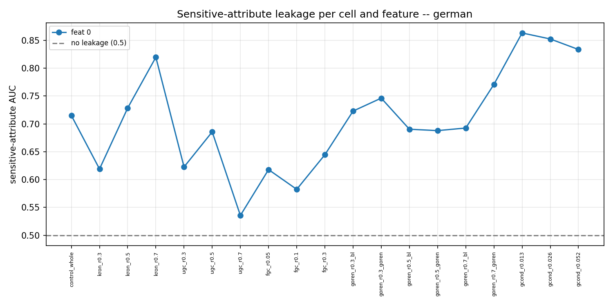

# Sensitive-attribute inference benchmark -- results

Can an adversary recover a hidden binary feature of a node from a black box trained on a reduced graph, given all other features? For each node the box is probed with the sensitive bit forced to 0 and to 1 (`Z=[p0||p1]`), and an MLP maps `Z` to the true bit, scored by AUC (0.5 = no leakage). German carries a real binary sensitive attribute -- Gender (feature 0, Female=1), mapped from german.csv -- so no stand-in feature is needed.

## german

AUC per cell (rows) and sensitive feature (cols). Pos-rate of each feature in the header.

| method/ratio | box acc | feat 0 (31% ones) |
|---|---|---|
| control | 72.4 | 0.715 |
| kron r0.3 | 70.8 | 0.619 |
| kron r0.5 | 68.3 | 0.728 |
| kron r0.7 | 61.6 | 0.820 |
| ugc r0.3 | 68.7 | 0.623 |
| ugc r0.5 | 66.7 | 0.686 |
| ugc r0.7 | 70.0 | 0.536 |
| fgc r0.05 | 70.0 | 0.618 |
| fgc r0.1 | 68.2 | 0.583 |
| fgc r0.3 | 68.4 | 0.645 |
| goren r0.3/bl | 69.4 | 0.723 |
| goren r0.3/goren | 69.5 | 0.746 |
| goren r0.5/bl | 67.5 | 0.690 |
| goren r0.5/goren | 70.1 | 0.688 |
| goren r0.7/bl | 68.2 | 0.693 |
| goren r0.7/goren | 69.9 | 0.771 |
| gcond r0.013 | 50.3 | 0.863 |
| gcond r0.026 | 53.2 | 0.852 |
| gcond r0.052 | 62.0 | 0.834 |

## Reading it

- **control** (no reduction) already leaks Gender well above chance (AUC ~0.72), even though the credit-label box barely beats the 70% majority baseline -- the posterior still encodes gender.
- Unlike the Cora/Citeseer stand-in features, here leakage varies a lot across methods and ratios: **GCond leaks most** (AUC ~0.83-0.86 at every ratio, *higher* than control) despite the worst task accuracy, so condensation concentrates rather than removes the sensitive signal; **KRON leakage climbs with aggressiveness** (0.62 -> 0.73 -> 0.82); and **UGC at r0.7 is the only cell near chance** (0.54).
- AUC near 0.5 means the two-world probe reveals nothing about the bit.

## Figures

