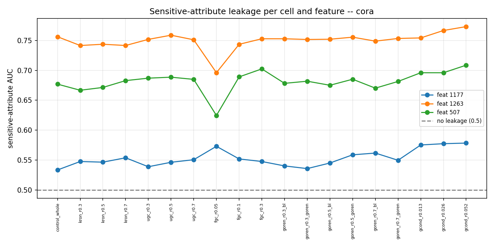
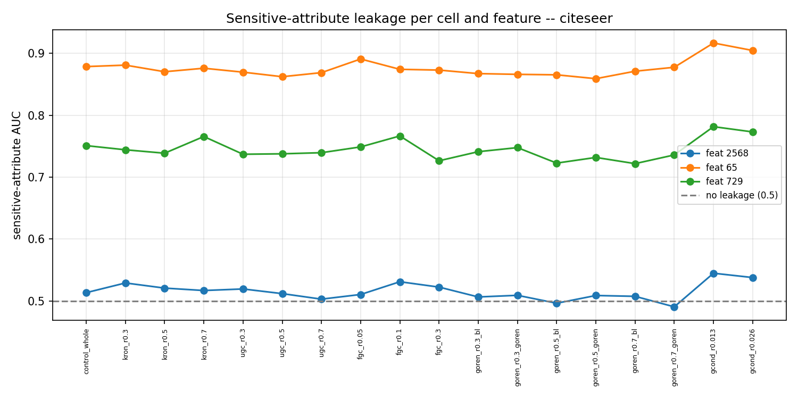

# Sensitive-attribute inference benchmark -- results

Can an adversary recover a hidden binary feature of a node from a black box trained on a reduced graph, given all other features? For each node the box is probed with the sensitive bit forced to 0 and to 1 (`Z=[p0||p1]`), and an MLP maps `Z` to the true bit, scored by AUC (0.5 = no leakage). Cora/Citeseer have no native sensitive attribute, so the most class-balanced binary features stand in; three per dataset.

## cora

AUC per cell (rows) and sensitive feature (cols). Pos-rate of each feature in the header.

| method/ratio | box acc | feat 1177 (40% ones) | feat 1263 (36% ones) | feat 507 (25% ones) |
|---|---|---|---|---|
| control | 96.6 | 0.533 | 0.756 | 0.677 |
| kron r0.3 | 93.0 | 0.548 | 0.742 | 0.667 |
| kron r0.5 | 89.7 | 0.546 | 0.744 | 0.671 |
| kron r0.7 | 86.8 | 0.554 | 0.742 | 0.683 |
| ugc r0.3 | 91.0 | 0.539 | 0.752 | 0.687 |
| ugc r0.5 | 88.1 | 0.546 | 0.759 | 0.689 |
| ugc r0.7 | 83.9 | 0.551 | 0.751 | 0.685 |
| fgc r0.05 | 45.6 | 0.573 | 0.696 | 0.625 |
| fgc r0.1 | 77.4 | 0.552 | 0.744 | 0.689 |
| fgc r0.3 | 83.6 | 0.548 | 0.753 | 0.702 |
| goren r0.3/bl | 92.6 | 0.540 | 0.753 | 0.678 |
| goren r0.3/goren | 92.3 | 0.536 | 0.752 | 0.682 |
| goren r0.5/bl | 90.1 | 0.545 | 0.752 | 0.675 |
| goren r0.5/goren | 90.0 | 0.559 | 0.755 | 0.685 |
| goren r0.7/bl | 84.5 | 0.562 | 0.749 | 0.670 |
| goren r0.7/goren | 88.0 | 0.550 | 0.753 | 0.681 |
| gcond r0.013 | 46.5 | 0.575 | 0.754 | 0.696 |
| gcond r0.026 | 59.9 | 0.577 | 0.767 | 0.696 |
| gcond r0.052 | 18.9 | 0.578 | 0.773 | 0.709 |

## citeseer

AUC per cell (rows) and sensitive feature (cols). Pos-rate of each feature in the header.

| method/ratio | box acc | feat 2568 (21% ones) | feat 65 (20% ones) | feat 729 (20% ones) |
|---|---|---|---|---|
| control | 92.4 | 0.514 | 0.879 | 0.751 |
| kron r0.3 | 85.7 | 0.529 | 0.881 | 0.744 |
| kron r0.5 | 81.7 | 0.521 | 0.870 | 0.739 |
| kron r0.7 | 78.2 | 0.517 | 0.876 | 0.766 |
| ugc r0.3 | 82.6 | 0.520 | 0.870 | 0.737 |
| ugc r0.5 | 77.9 | 0.512 | 0.862 | 0.738 |
| ugc r0.7 | 73.3 | 0.503 | 0.869 | 0.740 |
| fgc r0.05 | 56.3 | 0.511 | 0.891 | 0.749 |
| fgc r0.1 | 70.0 | 0.531 | 0.874 | 0.767 |
| fgc r0.3 | 72.4 | 0.523 | 0.873 | 0.726 |
| goren r0.3/bl | 85.8 | 0.507 | 0.867 | 0.741 |
| goren r0.3/goren | 85.4 | 0.509 | 0.866 | 0.748 |
| goren r0.5/bl | 81.2 | 0.496 | 0.865 | 0.723 |
| goren r0.5/goren | 81.9 | 0.509 | 0.859 | 0.732 |
| goren r0.7/bl | 75.0 | 0.508 | 0.871 | 0.722 |
| goren r0.7/goren | 80.0 | 0.491 | 0.877 | 0.736 |
| gcond r0.013 | 62.5 | 0.545 | 0.917 | 0.782 |
| gcond r0.026 | 49.8 | 0.538 | 0.904 | 0.773 |

## Reading it

- **control** is the leakage with no reduction.
- Leakage is dominated by *which* feature is sensitive (some bits are far more predictable from the graph and the other features than others), and is comparatively flat across reduction methods and ratios.
- AUC near 0.5 means the two-world probe reveals nothing about the bit.

## Figures

